 
## 查看主页获取源码

### 一、作品包含

源码+数据库+设计文档万字+PPT+全套环境和工具资源+部署教程

### 二、项目技术

前端技术：Html、Css、Js、Vue、Element-ui

数据库：MySQL

后端技术：Java、Spring Boot、MyBatis

  

### 三、运行环境

开发工具：IDEA/eclipse

数据库：MySQL5.7

数据库管理工具：Navicat10以上版本

环境配置软件： JDK1.8+Maven3.6.3

前端Nodejs：14

### 四、项目介绍
项目编号：springbootA339

共享单车管理系统通过技术手段，实现对共享单车的高效调配与精细管理，提升用户体验，促进绿色出行。

共享单车信息系统包括管理员、用户两个主要角色。管理员负责系统首页、个人中心、用户管理、区域管理、共享单车管理、单车租赁管理、租赁归还管理和报修信息管理等功能的维护和管理；而用户则可以进行系统首页浏览、个人中心管理、单车租赁管理、租赁归还管理以及报修信息管理的操作。

### 五、运行截图

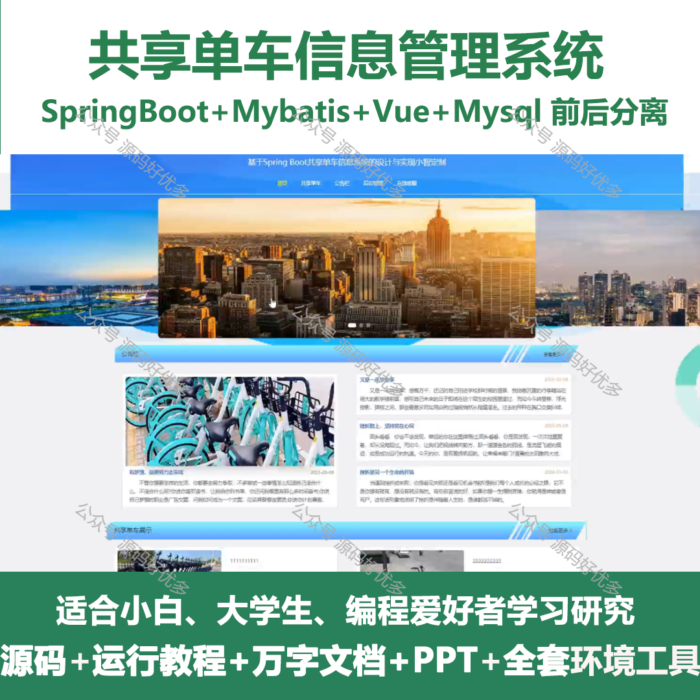
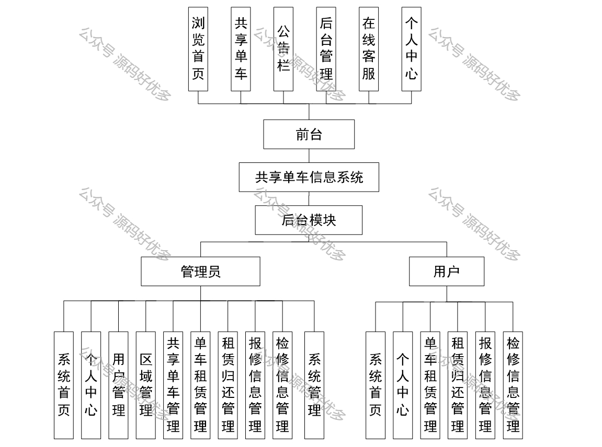
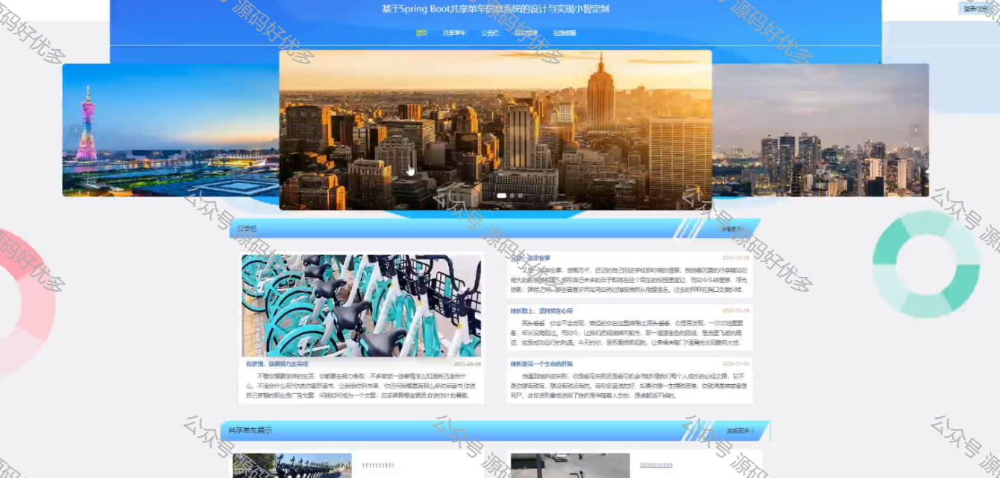
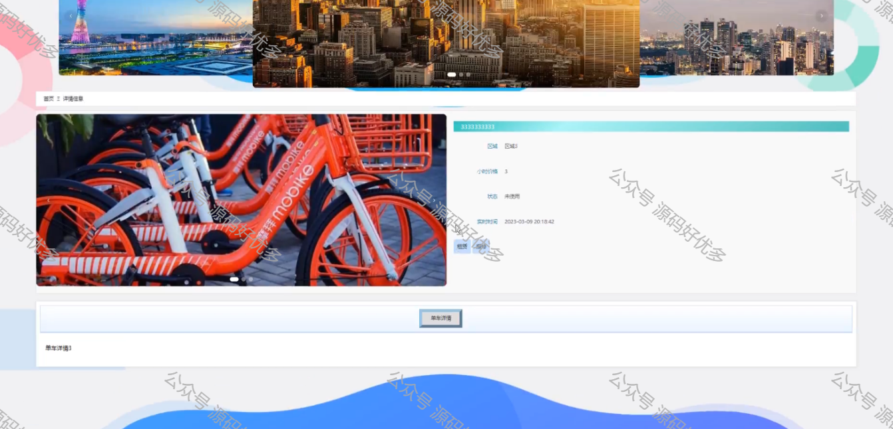
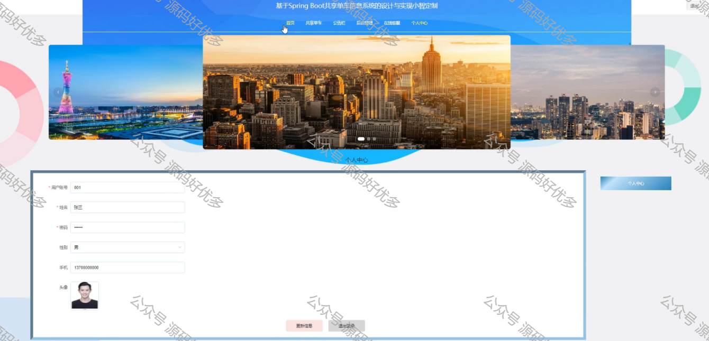
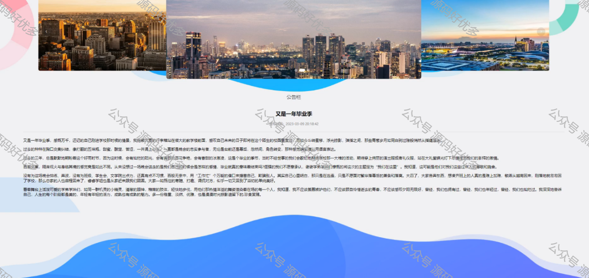

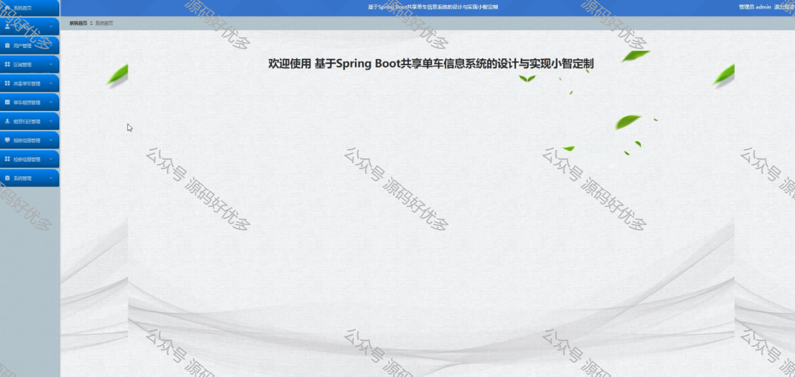
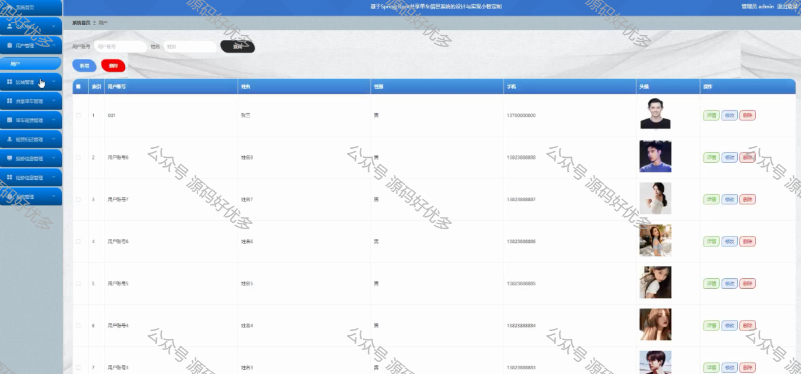
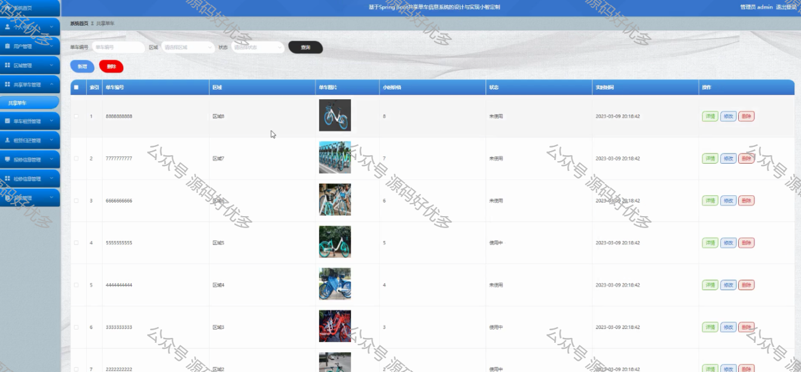
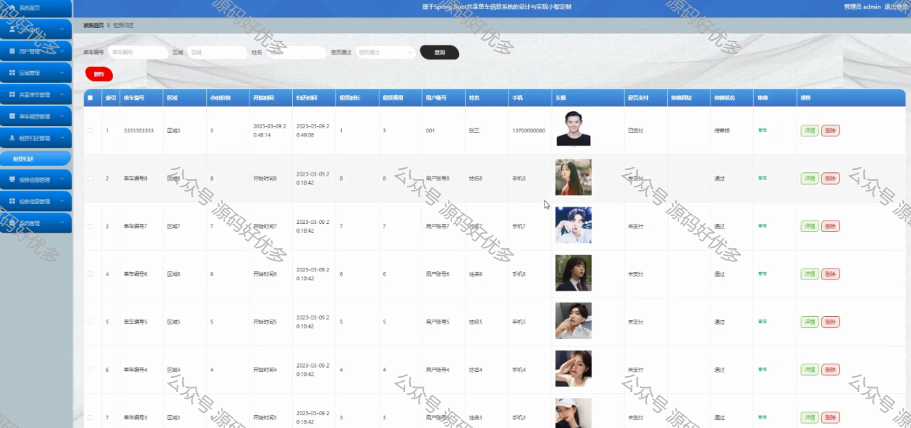
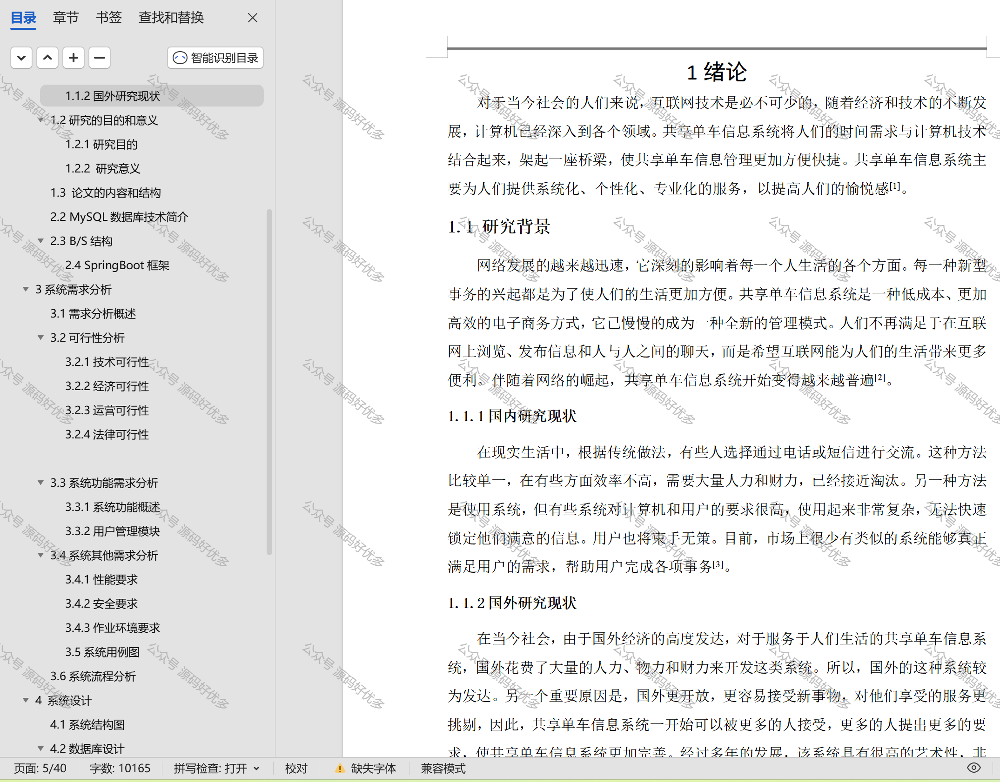

  
